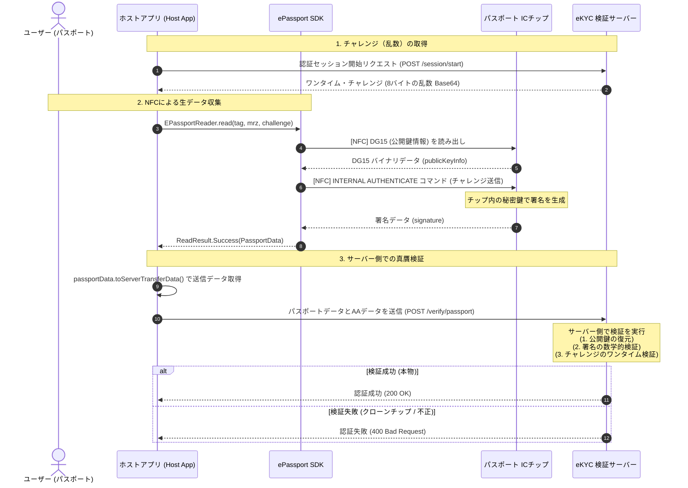

# Active Authentication (アクティブ認証) 統合・開発ガイド

本書は、eKYC サービスにおいて、電子パスポートの物理コピー（クローンカード）を検知・防止する **Active Authentication (AA / アクティブ認証)** を実装・統合するための、クライアント (Android SDK) およびバックエンド（サーバー）の共通開発ガイドラインです。

---

## 1. 概要と設計思想

### Active Authentication (AA) とは
電子パスポートの IC データ自体には改ざん防止のデジタル署名が入っていますが、そのデータを丸ごと別の空の IC カードにコピーした **「クローンパスポート」** が作成された場合、データ自体は正しいため、単なる署名検証だけではクローンであることを見破れません。

Active Authentication は、チップ内部のセキュアエリアに隠された **「読み出し不可能な秘密鍵」** と、`DG15` に格納された **「公開鍵」** を用い、チャレンジ＆レスポンスによる署名検証を行うことで、**「目の前にある IC チップがコピーではない物理的な本物であること」** を証明します。

### サーバーサイド検証モデル
本 SDK では、セキュリティおよび保守性を最大化するため、**「NFC 通信と生データ収集は SDK (ローカル)、署名の数学的検証は eKYC サーバー (バックエンド)」** で行うハイブリッド検証モデルを採用しています。

> [!IMPORTANT]
> **なぜローカルで検証してはいけないのか？**
> スマホのローカル上で検証判定を完結させると、アプリがリバースエンジニアリング（解析）され、「偽装パスポートでも常に認証成功（True）を返す」ように改造されたクラックアプリによる不正突破リスクが生じるためです。

---

## 2. システムシーケンス

以下は、ワンタイム・チャレンジ（リプレイアタック防止）を用いた Active Authentication の全体フローです。



---

## 3. クライアント（Android SDK）実装ガイド

### ① SDK 呼び出しの実装
ホストアプリ側では、サーバーから取得した `challenge` を `EPassportReader.read()` に渡します。
また、アクティブ認証の成否にかかわらず他の IC チップデータ（名前や顔写真）は正常に取得できる設計（Non-blocking）になっています。

```kotlin
// 1. サーバーから取得したチャレンジ (例: Base64で受け取ったものをバイト化)
val challengeBytes = Base64.decode(serverChallengeBase64, Base64.NO_WRAP)

// 2. SDK の読み取り実行
val result = EPassportReader.read(
    tag = nfcTag,
    mrzData = mrzData,
    challenge = challengeBytes,
    onProgress = { progress ->
        when (progress) {
            ReadProgress.PERFORMING_ACTIVE_AUTH -> println("アクティブ認証（クローン検知データ）の収集中...")
            else -> println("進捗: $progress")
        }
    }
)

when (result) {
    is ReadResult.Success -> {
        val passportData = result.passportData
        
        // 3. サーバー転送用にシリアライズされたデータ構造を取得
        val serverData = passportData.toServerTransferData()
        
        // 4. サーバーへ送信 (Retrofit等で POST)
        apiService.submitEkycData(serverData)
    }
    is ReadResult.Error -> {
        showError(result.exception)
    }
}
```

### ② サーバー転送用データ構造 (`PassportServerTransferData`)
SDK は、サーバー送信に適したように全てのバイナリを自動的に Base64 エンコードしたデータ構造を提供します。

```kotlin
data class PassportServerTransferData(
    val dg1: Dg1Data,                    // パース済みのMRZテキスト情報
    val faceImageBase64: String?,        // 顔写真の Base64 文字列 (DG2)
    val faceImageMimeType: String?,      // "image/jpeg" または "image/jp2"
    val activeAuthentication: Map<String, String>? // AA用データ (※下記参照)
)
```

`activeAuthentication` の中身（Map形式）：
* `publicKeyInfo`: `DG15` から読み出した公開鍵情報の Base64
* `challenge`: 署名に使用したチャレンジ乱数の Base64
* `signature`: チップが生成した署名データの Base64

> [!NOTE]
> **フォールバック挙動**
> パスポートが古い等の理由で `DG15`（アクティブ認証）をサポートしていない場合、`activeAuthentication` は `null` になりますが、`dg1` および `dg2` のデータは問題なく取得・転送できます。

---

## 4. バックエンド（サーバー）実装ガイド

サーバー側は、アプリから送られてきた `activeAuthentication` データを検証します。

### サーバーが処理すべき4つの検証ステップ

#### 【ステップ 1】 チャレンジのワンタイム検証 (Replay Attack Check)
リクエストに含まれる `challenge` が、そのセッション開始時にサーバー自身が発行したものであり、まだ使用されていない（期限内の）ものであるかを確認します。**検証完了後は直ちにそのチャレンジを無効化（ブラックリスト化）します。**

#### 【ステップ 2】 公開鍵 (DG15) の復元 (Decode)
送られてきた `publicKeyInfo` (Base64) をデコードします。このバイナリは **ASN.1 DERエンコード** された X.509 の `SubjectPublicKeyInfo` 規格に準拠しています。
Java / Kotlin (Bouncy Castle) を使用した復元例：

```kotlin
import org.bouncycastle.asn1.x509.SubjectPublicKeyInfo
import org.bouncycastle.openssl.jcajce.JcaPEMKeyConverter
import java.security.PublicKey

fun restorePublicKey(publicKeyInfoBytes: ByteArray): PublicKey {
    val spki = SubjectPublicKeyInfo.getInstance(publicKeyInfoBytes)
    return JcaPEMKeyConverter().getPublicKey(spki)
}
```

#### 【ステップ 3】 デジタル署名の検証 (Verify)
復元した公開鍵を用いて、送られてきた `signature` が `challenge` に対するものとして妥当かを検証します。

* **暗号アルゴリズムの判定：** `publicKeyInfo` の OID（Object Identifier）から、暗号方式が **RSA** か **ECDSA** かを自動判定します。
* **署名の検証処理（RSAの場合の例）：**
  ```kotlin
  import java.security.Signature
  
  fun verifySignature(publicKey: PublicKey, challenge: ByteArray, signatureBytes: ByteArray): Boolean {
      // パスポートの仕様上、通常は RAW または SHA256withRSA 等が使われます
      val signature = Signature.getInstance("SHA256withRSA") 
      signature.initVerify(publicKey)
      signature.update(challenge)
      return signature.verify(signatureBytes)
  }
  ```

> [!TIP]
> **ICAO Doc 9303 Part 11 による補足仕様**
> パスポートの種類によっては、署名対象のメッセージ（Message Digest）が単なる `challenge` そのものではなく、`challenge + nonce` などのパディングやハッシュ化がチップ内で行われている場合があります。検証ライブラリの実装時には ICAO 規格書の「Active Authentication Mechanism」のデータフォーマットとパディングルールを確認してください。

#### 【ステップ 4】 最終判定の確定
* 署名検証が **成功（True）** ➡ チップの秘密鍵が本物と証明されたため、**「本物のパスポート（クローンではない）」** と判定。
* 署名検証が **失敗（False）** ➡ コピーされた偽装チップとみなして **「不正検知（偽造アラート）」** を出力。

---

## 5. 運用開発上の注意点

* **端末依存のNFCタイムアウトに注意：**
  * `INTERNAL AUTHENTICATE` コマンドは、チップの内部で暗号署名を生成するため、通常のデータブロック読み出しよりも処理時間がかかります（約0.5〜1.5秒）。
  * SDK内の `IsoDepTransceiver.timeout` は **10000ms (10秒)** に設定されているためタイムアウトエラーは回避されますが、読み取り完了までユーザーに「スマホを動かさないでください」と伝えるUI/UX設計をホストアプリ側に推奨してください。
* **CSCA証明書（パシブ認証用）との役割分担：**
  * 本ガイドの **Active Authentication (AA)** は「クローン防止」です。
  * チップ内のデータ自体が本物かどうかの改ざん検証には、別途 **Passive Authentication (PA)** と各国の国家公開鍵（CSCA証明書）が必要です。これらはサーバー側の同一検証モジュール内に並列で実装することをお勧めします。
