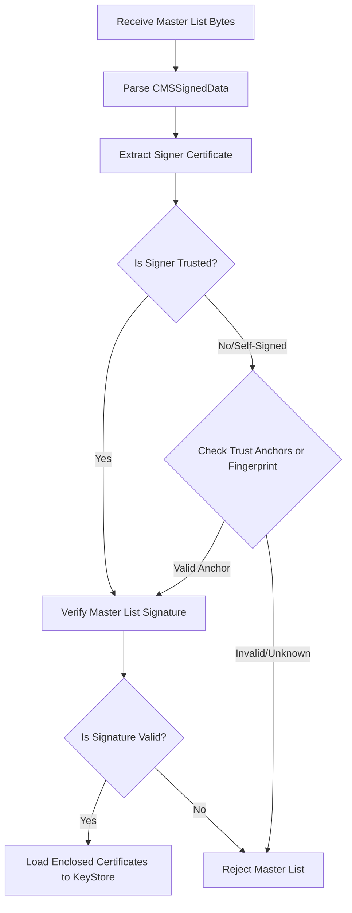

# CSCA Master List Verification & Management Design

## 1. Background & Objectives
Passive Authentication (PA) checks the digital signature of the ePassport's Document Security Object (`EF.SOD`). To ensure this signature is genuine, the server must verify the Document Signer (DS) certificate against a trusted Country Signing Certification Authority (CSCA) certificate. 

Since CSCA certificates are issued by sovereign nations, they must be retrieved and managed through a trusted **CSCA Master List** (standardized in ICAO Doc 9303 Part 12). This document specifies the design for parsing, validating, caching, and dynamically updating CSCA Master Lists.

---

## 2. ASN.1 Structure & Parsing
A CSCA Master List is packaged as a CMS `SignedData` structure (wrapped in `ContentInfo`).

```
ContentInfo ::= SEQUENCE {
    contentType OBJECT IDENTIFIER, -- id-signedData (1.2.840.113549.1.7.2)
    content [0] EXPLICIT SignedData
}

SignedData ::= SEQUENCE {
    version CMSVersion,
    digestAlgorithms DigestAlgorithmIdentifiers,
    encapContentInfo EncapsulatedContentInfo, -- Contains the SubjectKeyIdentifier list
    certificates [0] IMPLICIT CertificateSet OPTIONAL, -- CSCA Certificates list
    crls [1] IMPLICIT RevocationInfoChoices OPTIONAL,
    signerInfos SignerInfos
}
```

### 2.1 Extraction Process
1. Initialize Bouncy Castle's `CMSSignedData` parser with the master list raw bytes.
2. Verify the master list's structure.
3. Extract all `X509CertificateHolder` objects from the `certificates` set.
4. Convert holders to standard `java.security.cert.X509Certificate` using `JcaX509CertificateConverter`.

---

## 3. Master List Signature Verification
A Master List itself is digitally signed. Before trusting the certificates inside the list, the master list's signature must be verified.



1. **Signer Extraction**: Retrieve the `SignerInformation` from `CMSSignedData.signerInfos`. Match the signer's identity (`SignerId`) with certificates in the master list's certificate block using `SubjectKeyIdentifier` or `IssuerAndSerialNumber`.
2. **Signature Verification**: Use `JcaSimpleSignerInfoVerifierBuilder` to verify the signer's signature over the master list payload.
3. **Trust Validation**: Check if the signer's certificate itself is issued by a trusted Master List Signer or matches a pre-configured trust anchor fingerprint.

---

## 4. Caching & Expiration Management
To prevent high-latency network roundtrips during passport scanning, CSCA certificates must be cached locally in a secure trust store (`KeyStore`).

### 4.1 Caching Strategy
- **Client-Side (Android)**: Cache loaded CSCA certificates inside a dedicated `KeyStore` file encrypted via Android Keystore system.
- **Server-Side**: Store CSCA certificates in memory (`CscaTrustStore`) backed by a persistent relational database or secure cache store (e.g., Redis).

### 4.2 Expiration Policy
1. **CSCA Validity Check**: Periodically scan the cached CSCA certificates. Any certificate whose `notAfter` timestamp is past the current local time is marked as expired and ignored during PA.
2. **Periodic Cleanup**: A background worker (on the server side) or lifecycle handler (on the client side) should prune expired certificates from the active trust store.

---

## 5. Delta (Incremental) Update Design
CSCA Master Lists are updated occasionally when countries issue new CSCA certificates or revoke existing ones. To minimize bandwidth usage, we utilize an incremental/delta update flow.

```
+------------------+                    +-------------------------+
|                  |     GET /latest    |                         |
|   Server / SDK   | -----------------> |   ICAO PKD / Backend    |
|                  |  If-None-Match ETag|                         |
+------------------+                    +-------------------------+
         |                                           |
         | <--------------- 304 Not Modified --------+ (No action needed)
         |                                           |
         | <--- 200 OK (New Master List Payload) ----+
         |
    Verify & Parse
         |
    Diff with KeyStore
         |
    Insert New / Delete Revoked
```

1. **ETag & Etag-based Conditional Requests**: The server/SDK stores the ETag or Last-Modified header of the downloaded master list. During update checks, it sends conditional HTTP requests. If the list hasn't changed, a `304 Not Modified` response avoids downloading the payload.
2. **Differential Merging**:
   - Compare the certificate identifiers (`SubjectKeyIdentifier`) in the new master list with the locally cached certificates.
   - Insert new CSCA certificates.
   - Remove certificates that are present in the local cache but missing in the updated master list (which indicates revocation or deprecation).
3. **CRL & Revocation Checking**:
   - Download Certificate Revocation Lists (CRLs) associated with the CSCA certificates.
   - Reject certificates matched against CRLs during Passive Authentication.

---

## 6. Integration and Testing Plan
1. **MockMasterList Generation**: Use `CMSSignedDataGenerator` to generate test master lists signed with valid/invalid keys to verify error paths.
2. **Fuzzing and Corrupted Payload Verification**: Inject corrupted ASN.1 sequences to ensure the parser fails gracefully with `InvalidDataException` rather than throwing unexpected RuntimeExceptions.
