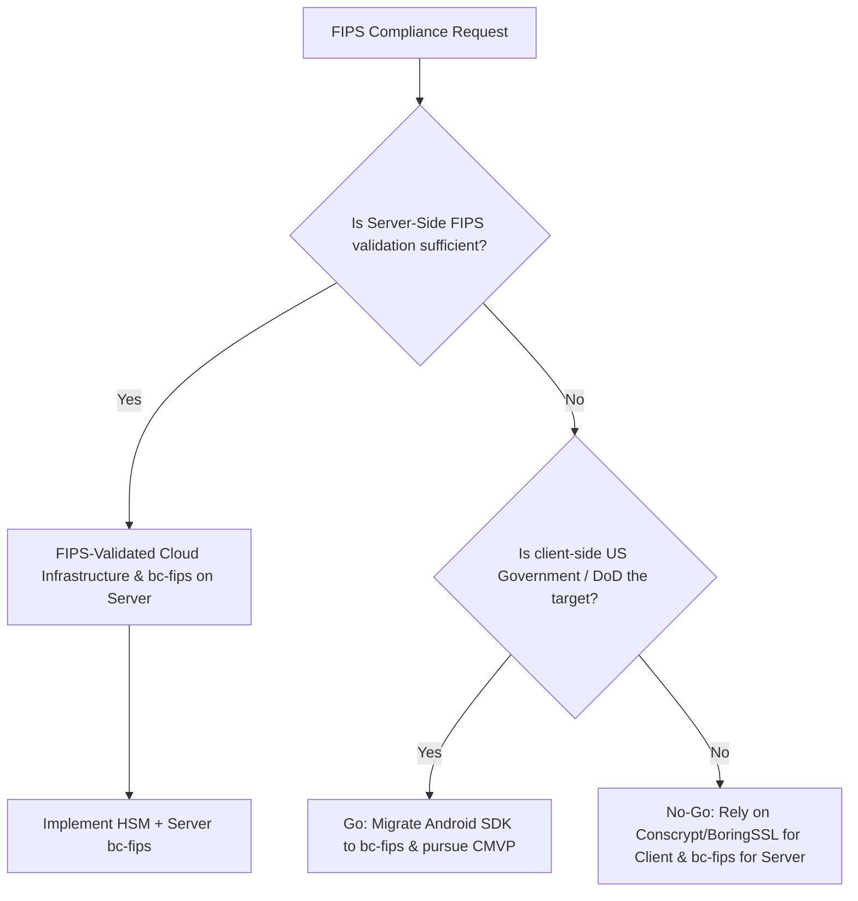

# FIPS 140-2 / 140-3 Cryptographic Module Certification Evaluation

## 1. Objective & Scope
This evaluation assesses the feasibility, cost, timeline, and architectural impact of pursuing FIPS (Federal Information Processing Standards) 140-2 or 140-3 Cryptographic Module Validation for the `epassport-nfc-sdk-android` SDK and server-side verification backend.

---

## 2. Cryptographic Architecture & FIPS Gaps

The codebase utilizes standard cryptographic libraries. Here is the FIPS alignment status:

| Module / Component | Primitive / Use Case | Current Engine | FIPS Compliance Status |
|---|---|---|---|
| **Client (Android)** | Local DB / Preferences Encryption | Android Keystore / Conscrypt | **Adherent** (Uses device TEE/SE, which typically carries FIPS 140-2 Level 1 or 2 validation by the SoC manufacturer). |
| **Client & Server** | Secure Messaging (SM) MAC | Bouncy Castle (Triple DES / AES) | **Non-Compliant** (Standard `bcprov-jdk18on` is not FIPS validated). Triple DES is deprecated in newer FIPS standards (FIPS 140-3), creating a protocol-level conflict since eMRTD standards mandate 3DES for BAC/PACE. |
| **Server-Side** | E2EE Decryption (RSA-OAEP-256) | Bouncy Castle | **Non-Compliant** (Uses standard Bouncy Castle). |

---

## 3. Migration Roadmap to Bouncy Castle FIPS (bc-fips)

To align the server and client with FIPS mandates, we must migrate cryptographic operations to Bouncy Castle FIPS Java API (`bc-fips`).

### 3.1 Migration Steps
1. **Dependency Replacement**:
   Replace `org.bouncycastle:bcprov-jdk18on` with `org.bouncycastle:bc-fips:1.0.2.4` (or latest FIPS-certified release) in `server/build.gradle.kts` and `sdk-nfc/build.gradle.kts`.
2. **Provider Registration**:
   Register the `BouncyCastleFipsProvider` instead of `BouncyCastleProvider`.
   ```kotlin
   import org.bouncycastle.jcajce.provider.BouncyCastleFipsProvider
   Security.insertProviderAt(BouncyCastleFipsProvider(), 1)
   ```
3. **Algorithm Adaptation**:
   Ensure all cipher instantiation strings match the FIPS-approved naming conventions (e.g., `AES/GCM/NoPadding` under BC FIPS).

---

## 4. Certification Cost, Timeline, & Process

Obtaining a FIPS validation is a formal process administered by the NIST **Cryptographic Module Validation Program (CMVP)**.

```
[Design & Code Audit] ---> [Contracting CST Lab] ---> [Lab Testing & Review] ---> [CMVP Panel Review] ---> [Certificate Issued]
     (2-4 Months)               (1 Month)                (3-6 Months)              (6-12 Months)
```

### 4.1 Estimated Costs
- **CST Lab Testing Fees**: $45,000 - $75,000 (depending on FIPS level and scope).
- **Consulting Fees**: $20,000 - $40,000.
- **Internal Engineering / Resource Cost**: 2-3 dedicated engineers for 3-6 months.
- **Total Financial Estimate**: **$80,000 - $150,000 USD** (excluding internal labor).

### 4.2 Estimated Timeline
- **Preparation & Migration**: 2 - 4 months.
- **Lab Evaluation**: 3 - 6 months.
- **NIST Coordination & Validation**: 6 - 12 months.
- **Total Timeline**: **12 - 22 months**.

---

## 5. Go / No-Go Decision Framework

We recommend a **Split-Architecture Go/No-Go** approach:



### 5.1 Recommendations
1. **Server-Side: GO**
   - *Rationale*: Server-side migration to `bc-fips` is highly feasible. It can be paired with an AWS CloudHSM or Google Cloud HSM (which are FIPS 140-2 Level 3 validated out of the box), bypassing the need for us to certify our own proprietary code.
2. **Client-Side (Android SDK): NO-GO (Adherence Only)**
   - *Rationale*: Device hardware variance makes OS-level CMVP certification impractical for a software-only SDK. Instead of certifying the SDK, we should ensure **FIPS Adherence** by utilizing the Android OS FIPS-validated BoringSSL cryptographic provider (Conscrypt) for symmetric and asymmetric algorithms.
