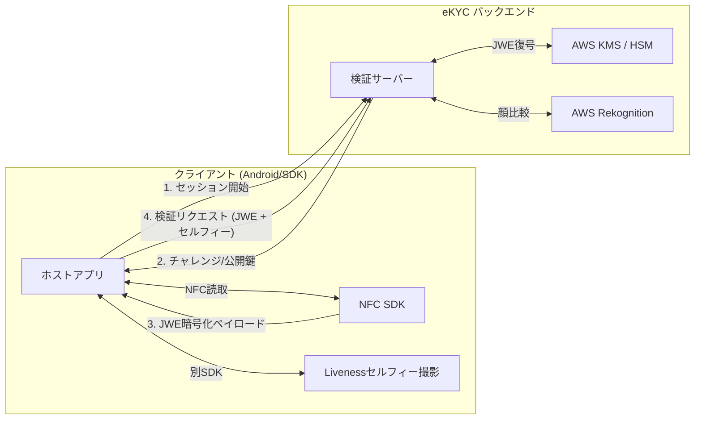
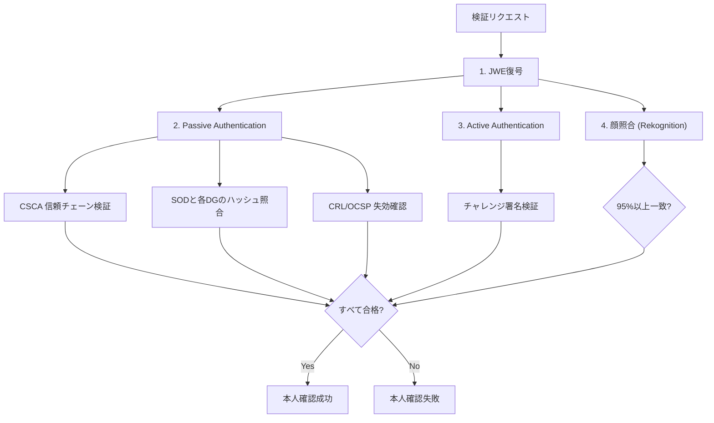

# EPassport NFC SDK 導入・連携ガイド

本ドキュメントは、EPassport NFC SDK を用いてセキュアな商用 eKYC システムを構築する開発者向けの導入・バックエンド連携ガイドです。

---

## 1. 全体アーキテクチャ概要 (Architecture Overview)

本SDKは、「フロントエンド（SDK）でのデータ収集・保護」と「バックエンドでの検証・判定」を厳密に分離するハイブリッド型eKYC設計を採用しています。



### なぜ検証をサーバーで行うのか？
* **耐タンパー性**: クライアントアプリやOS（Root化、エミュレータなど）の改ざんによる「検証OK」の偽装を防止するため。
* **ルート証明書（CSCA）の保護**: 国別信頼アンカーであるCSCA証明書や、毎日更新される失効リスト（CRL）を安全に保持するため。
* **APIキーの秘匿性**: Amazon Rekognition や各種認証局連携の資格情報をクライアント側に持たせないため。

---

## 2. クライアント（SDK）側で追加対応すべきセキュリティ項目

ハイブリッドeKYCを安全に運用するために、SDK単体で今後さらに強化・対応すべき推奨事項は以下の通りです。

### 2.1. PACE (Password Authenticated Connection Establishment) プロトコルへの対応
* **現状**: 現在の `ReadPassportUseCase` は BAC (Basic Access Control) のみで通信暗号化を確立しています。
* **推奨アクション**: BACは 3DES ベースで暗号強度が低く、ICAOでは PACE（AES-GCMやECDH）への移行が推奨されています。特に日本のマイナンバーカードの読み取り等では PACE が必須となるため、SDK側で `PaceAuthenticator` と `EPassportReader` の統合ルートを実装する必要があります。

### 2.2. Google Play Integrity API の統合
* **現状**: SDK内の `RuntimeSecurityChecker` はローカルでの Root/デバッグ/エミュレータチェックのみを行っていますが、最新の偽装ツール (Magisk, KernelSU) で容易にバイパスされます。
* **推奨アクション**: ホストアプリまたはSDK内で Google Play Integrity API を呼び出して整合性トークン（Integrity Token）を取得し、バックエンドへ送信します。バックエンドは Google サーバーと通信してデバイス・アプリの真正性を検証します。

### 2.3. NFC接続瞬断時のリトライ・キャッシュ機構
* **現状**: DG2（顔写真）のデータはサイズが大きく（数万〜数十万バイト）、読み取りに数秒かかります。途中で端末がズレると接続切れが発生します。
* **推奨アクション**: 接続エラー時に最初からやり直すのではなく、すでに読み取りに成功した DG1 などをメモリにセキュアに保持（キャッシュ）し、再接続後に未取得の DG2 のみから読み取りを再開できるレジューム機構を実装します。

---

## 3. クライアント（ホストアプリ）の実装手順

ホストアプリ側で、NFC読み取りとバックエンド送信を行う基本コード例です。

```kotlin
// 1. サーバーからチャレンジと暗号化用公開鍵を取得
val sessionInfo = backendApi.startSession() // challenge と publicKeyPem を取得

// 2. NFCリーダーの起動
val result = EPassportReader.read(
    context = this,
    tag = nfcTag,
    mrzData = mrzData,
    challenge = sessionInfo.challengeBytes,
    allowDebug = BuildConfig.DEBUG
)

when (result) {
    is ReadResult.Success -> {
        // メモリ保護のため、平文データは即座にJWE (AES-GCM-256) で暗号化
        val encryptedJwe = result.data.toJwePayload(sessionInfo.publicKeyPem)
        
        // 3. セルフィー撮影（Liveness検知済）画像を取得し、合わせてバックエンドに送信
        val selfieBytes = captureLivenessSelfie()
        
        backendApi.verify(
            nfcPayload = encryptedJwe,
            selfieBase64 = Base64.encodeToString(selfieBytes, Base64.NO_WRAP)
        )
    }
    is ReadResult.Error -> {
        handleNfcError(result.exception)
    }
}
```

---

## 4. バックエンド（検証サーバー）の実装要求要件

バックエンドは、クライアントからの暗号化データを復号した上で、以下の 4つのコア検証 を実装する必要があります。



### 4.1. JWE の復号 (E2EEの終端)
セキュリティを最大化するため、バックエンド側のプライベートキーは AWS KMS / GCP Cloud HSM に格納し、サーバー内に生の秘密鍵を持たない設計とします。
* **暗号アルゴリズム**: RSA-OAEP-256 (鍵カプセル化) + AES-GCM-256 (コンテンツ暗号化)。

### 4.2. Passive Authentication (PA) の検証
ICチップ内のデータが改ざんされていないこと、および国家機関（政府）によって発行されたものであることを検証します。
* **DS証明書（Document Signer）の検証**: SOD から抽出したDS証明書の有効期限と拡張Key Usage（`documentSigner` / `IID_KP_DOCUMENT_SIGNER`）を確認します。
* **CSCA（Country Signing Certification Authority）信頼チェーンの構築**: サーバーが同期している信頼できるCSCAルート証明書ストアを用い、DS証明書 -> CSCA証明書 へのパス検証を行います。
* **CRL (証明書失効リスト) 検証**: 毎日バッチ同期されるCRLから、DS証明書が失効していないかを検証します。
* **DGハッシュ値の検証**: SOD（Document Security Object）のデジタル署名を検証した上で、SOD内に記録されている各DG（DG1, DG2, DG15）のハッシュ値が、実際にNFCから読み取った各DGのバイナリのハッシュ値と一致することを確認します。

### 4.3. Active Authentication (AA) の検証
ICチップが物理的に「クローン」された偽造品でないことを検証します。
* **DG15から公開鍵を復元**: DG15 からActive Authentication用の公開鍵（RSAまたはECDSA）を取得します。
* **署名検証**: SDKから送られてきた `signature` が、手順1でサーバーから発行した `challenge` に対して、DG15公開鍵を用いて作成された署名と一致することを検証します。

### 4.4. Amazon Rekognition による顔照合
NFCから抽出した真正な顔写真（DG2 のRAWバイナリ）と、別撮影されたセルフィー画像を比較します。
* **推奨類似度閾値**: 95%以上。
* **処理**: バックエンドで `CompareFacesAPI` を呼び出し、結果スコアに基づいて合否を判定します。

---

## 5. バックエンド運用・バッチ設計（CSCA & CRL の自動更新）

PA検証の信頼性を保つため、バックエンド側には以下の同期バッチが必要です。
* **CSCAマスターリストの同期**: ICAO PKD（Public Key Directory）や各国の政府ポータルから最新のCSCAマスターリスト（`.ml` または `.ldif` ファイル）を週次または日次で自動ダウンロードし、サーバーの信頼ストア（KeyStore）を更新します。
* **CRLの同期**: 各国の証明書配布ポイントから最新のCRLファイルを定期的に自動収集し、データベースの失効シリアル番号リストを更新します。
